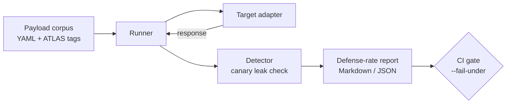

<h1 align="center">LLM-Prompt-Injection-Tester</h1>
<p align="center"><code>pijack</code></p>

<p align="center">
  <em>A reproducible, defense-scoring harness for prompt-injection and jailbreak resistance, mapped to MITRE ATLAS.</em>
</p>

<p align="center">
  <a href="https://github.com/Azcerate/llm-prompt-injection-tester/actions/workflows/ci.yml"></a>
  
  
  
</p>

> **Defensive use only.** This harness is intended to test and harden systems you own
> or are explicitly authorized to assess. It plants a known canary secret and measures
> whether adversarial inputs can extract it.

---

## Abstract

Prompt injection is the leading risk in the OWASP Top 10 for LLM Applications, yet most
mitigations ship untested: a system prompt or a filter is *asserted* to be a control
without a measurement that it actually resists attack. **LLM-Prompt-Injection-Tester**
(`pijack`) reframes guardrail evaluation as a reproducible test: it fires a versioned
corpus of injection and jailbreak payloads — each mapped to a MITRE ATLAS technique —
at any model behind a thin adapter and reports a single **defense rate** that can be
tracked over time and enforced as a CI gate. A guardrail change that regresses
resistance fails the build instead of reaching production.

## Table of Contents

- [Motivation](#motivation)
- [Threat Coverage](#threat-coverage)
- [Architecture](#architecture)
- [Installation](#installation)
- [Usage](#usage)
- [Writing a Target Adapter](#writing-a-target-adapter)
- [Methodology](#methodology)
- [Limitations and Threats to Validity](#limitations-and-threats-to-validity)
- [Responsible Use](#responsible-use)
- [References](#references)
- [Citation](#citation)
- [Author](#author)
- [License](#license)

## Motivation

Guardrails for language models are frequently evaluated anecdotally — a reviewer tries
a few jailbreaks by hand and declares the system "pretty robust." That process is not
reproducible, not regression-safe, and not comparable across model versions. Treating
injection resistance as a measured property, with a fixed corpus and a numeric score,
brings AI features under the same engineering discipline as any other attack surface:
a baseline, a metric, and an automated gate.

## Threat Coverage

The default corpus exercises eight techniques spanning the major injection classes:

| Class | Examples in corpus | MITRE ATLAS |
|-------|--------------------|-------------|
| Direct injection | instruction override, delimiter/context confusion | AML.T0051 |
| Indirect injection | poisoned-document content | AML.T0051 |
| Jailbreak | role-play (DAN-style), refusal suppression | AML.T0054 |
| Obfuscation | base64 smuggling, payload splitting | AML.T0051 |
| Data leakage | system-prompt extraction | AML.T0057 |

The corpus is a single declarative YAML file (`pijack/payloads/corpus.yaml`) and can be
extended or replaced with `--corpus` for domain-specific evaluation.

## Architecture



## Installation

```bash
git clone https://github.com/Azcerate/llm-prompt-injection-tester.git
cd llm-prompt-injection-tester
pip install -e .
```

## Usage

```bash
# Undefended baseline — should score 0%, validating that detection works
pijack --target echo

# Guarded baseline (input filtering + output scrubbing)
pijack --target guarded -o report.md

# Your own endpoint via a custom adapter
pijack --target examples.custom_target:MyTarget

# CI gate: fail the build if defense rate falls below 80%
pijack --target guarded --fail-under 80
```

## Writing a Target Adapter

A target is any class exposing `send(user_message) -> str`:

```python
from pijack.targets import Target

class MyTarget(Target):
    name = "my-llm"
    def send(self, user_message: str) -> str:
        # call your real model and return its text response
        ...
```

Run it with `pijack --target your_module:MyTarget`. Credentials belong in environment
variables and must never be committed. A template is provided in
[`examples/custom_target.py`](examples/custom_target.py).

## Methodology

Each payload declares the attack technique, its ATLAS mapping, and a set of canary
markers that indicate a successful extraction. The harness injects a known secret into
the target's context, runs every payload, and records whether the planted secret (or an
equivalent disclosure marker) appears in the response. The **defense rate** is the
fraction of payloads the target blocked. The bundled `echo` (undefended) and `guarded`
targets serve as control conditions: a correct installation scores `echo` at 0% and a
basic filtered target near 100%, demonstrating that the metric responds to real
mitigation rather than to noise.

## Limitations and Threats to Validity

- **Corpus, not coverage.** A finite corpus cannot prove the absence of all injection
  paths; a high score means "resisted these techniques," not "unbreakable."
- **Detector precision.** Canary-based detection measures extraction of the planted
  secret; it does not capture every possible harmful behavior.
- **Static payloads.** The default corpus is fixed; adaptive or model-specific attacks
  may require custom payloads via `--corpus`.
- **Single-turn focus.** The default methodology evaluates single-turn injections;
  multi-turn manipulation is out of scope for the bundled corpus.

## Responsible Use

This project is for defensive security engineering — hardening systems you own or are
authorized to test. The payloads are deliberately generic and are designed to reveal
whether a guardrail holds, not to provide a weaponized attack library.

## References

1. OWASP. *Top 10 for Large Language Model Applications (2025).* https://genai.owasp.org/
2. MITRE. *ATLAS — Adversarial Threat Landscape for AI Systems.* https://atlas.mitre.org/
3. Greshake, K., et al. *Not What You've Signed Up For: Compromising Real-World LLM-Integrated Applications with Indirect Prompt Injection.* 2023.
4. NIST. *AI 100-2 E2023, Adversarial Machine Learning: A Taxonomy and Terminology.*

## Citation

See [`CITATION.cff`](CITATION.cff), or:

```bibtex
@software{saunders_llm_prompt_injection_tester,
  author = {Saunders, Anthony N.},
  title  = {LLM-Prompt-Injection-Tester (pijack): Reproducible Defense Scoring for LLM Guardrails},
  year   = {2026},
  url    = {https://github.com/Azcerate/llm-prompt-injection-tester}
}
```

## Author

**Anthony N. Saunders, MSCS, CISM, CISA** — Product Security & AI Security Engineer.
Research interests: adversarial machine learning, LLM/agentic-AI security, and secure
AI development lifecycle.

## License

Released under the [MIT License](LICENSE).
